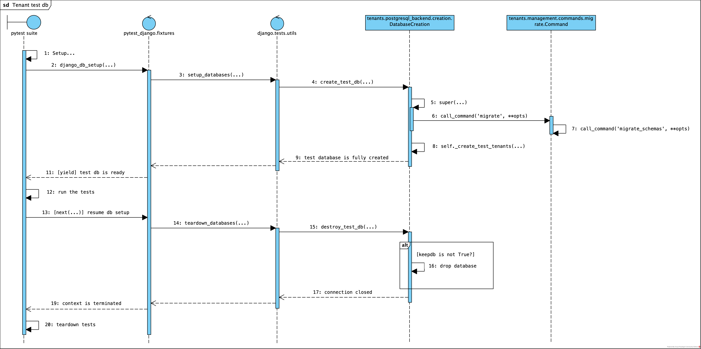

# tenants.postgresql_backend

## database creation for tests

1. `tests.conftest.pytest_configure` sets `sys._called_from_test` to `True`
1. `pytest` invokes the `pytest_django.fixtures.django_db_setup` fixture
  1. The fixture invokes the context manager `django.test.utils.setup_databases`
    1. Invokes `tenants.postgresql_backend.creation.DatabaseCreation.create_test_db`
      1. Migrations are ran `call_command('migrate', **opts)` which calls `tenants.management.commands.migrate.Command`
        1. Invokes `migrate_schemas` underneath
      1. Create the tenants: `tenants.postgresql_backend.creation.DatabaseCreation._create_test_tenants`
1. `pytest` continue set-up
1. `pytest` runs the tests
1. `pytest` teardowns `pytest_django.fixtures.django_db_setup`
  1. Calls `django.test.utils.teardown_databases`
    1. Calls `tenants.postgresql_backend.creation.DatabaseCreation.destroy_test_db`
      1. Drops the database if `keepdb=False` (when `--reuse-db` is not set)
      1. Otherwise does nothing
1. `tests.conftest.pytest_unconfigure` deletes `sys._called_from_test`.
